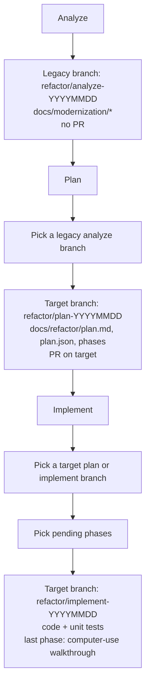

# Workflows

Analyze, Plan, and Implement. Each step starts a cloud agent with both repos checked out. Artifacts land on a dated `refactor/*` branch.

- **Analyze** maps the legacy system. Target repo is context only.
- **Plan** reads that analyze branch and writes a phased plan on the target repo.
- **Implement** codes selected phases on the target. Unit tests run first; computer-use UI testing is only the last phase.
