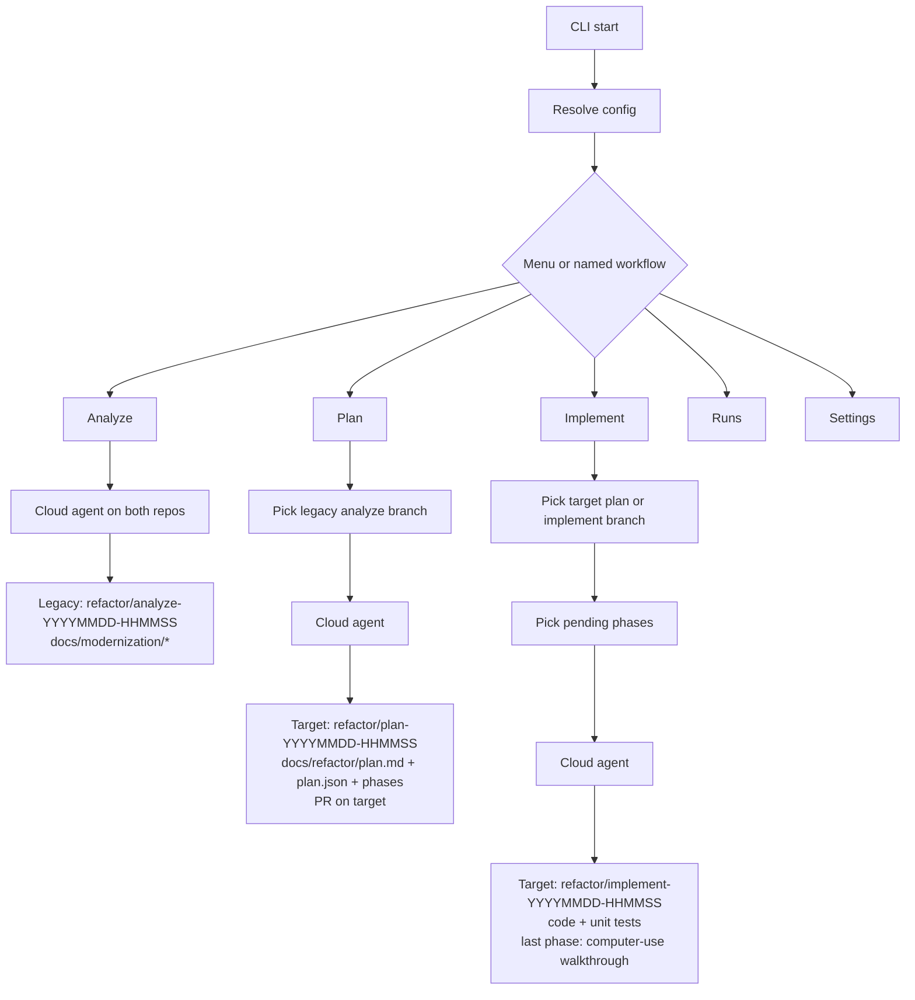

# Workflows

Each workflow starts a cloud agent with both repositories. Artifacts land on a dated `refactor/*` branch.

Analyze writes discovery docs on the **legacy** repo and does not open a PR. Plan and Implement write on the **target** repo; Plan opens a PR. Implement runs `test_command` per selected unit-test phase and runs computer-use UI checks only as the last plan phase.
