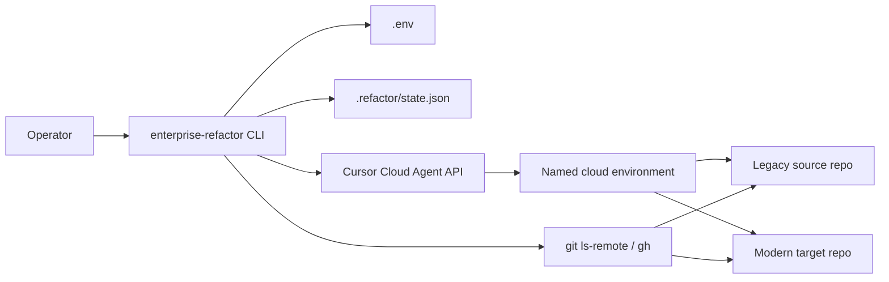
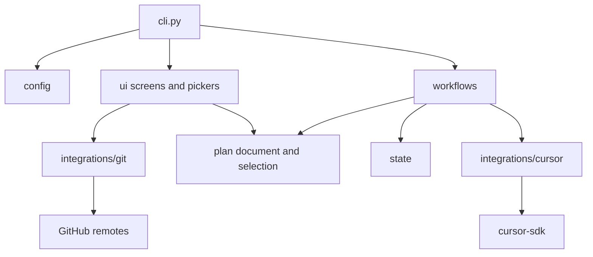
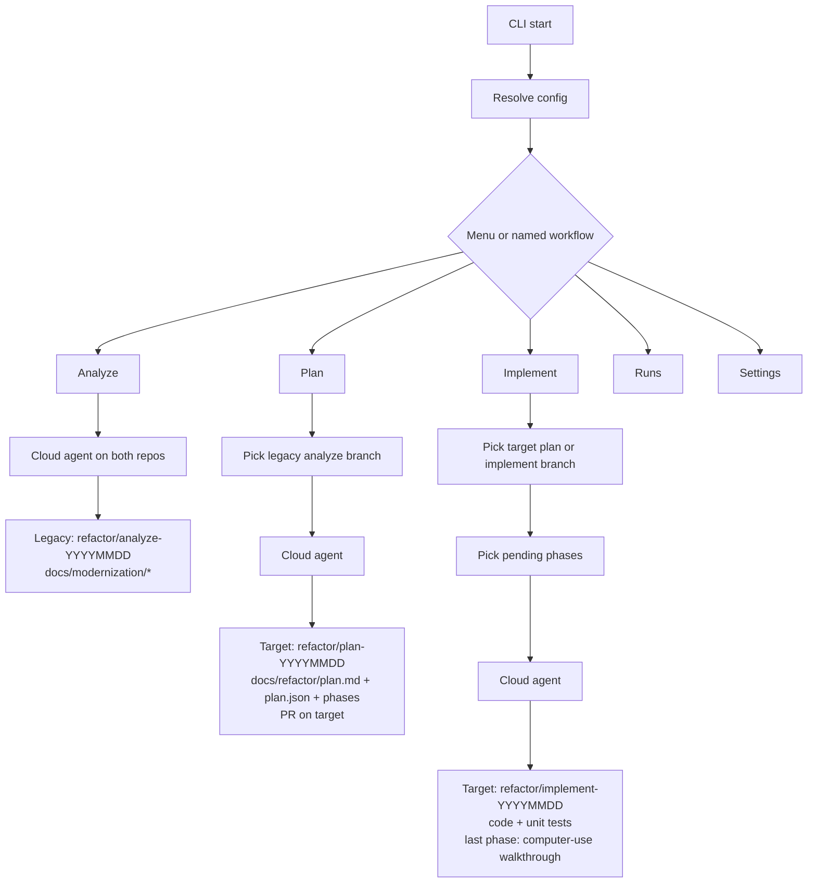

# Architecture

High-level view of how the CLI drives Analyze, Plan, and Implement on Cursor Cloud Agents.

## System context

The local CLI never edits the two application repos itself. It collects settings, picks a branch and phases, then starts a cloud agent that already has both git checkouts.

## CLI packages

| Package | Role |
| --- | --- |
| `cli` | Flags, home menu, dispatch to a workflow |
| `config` | Resolve API key, repos, env, and model from flags / `.env` / prompts |
| `ui` | TUI home, runs, settings, and input |
| `pickers` | Analyze-branch, implement-branch, and phase lists |
| `workflows` | Analyze, Plan, and Implement prompts plus result handling |
| `integrations/cursor` | Session, stream, poll, and extract cloud-run results |
| `integrations/git` | List remotes and read `plan.json` from a branch |
| `plan` | Parse phase flags and plan documents |
| `state` | Last agent IDs and branch names |

## Workflows

Each workflow starts a cloud agent with both repositories. Artifacts land on a dated `refactor/*` branch.

Analyze writes discovery docs on the **legacy** repo and does not open a PR. Plan and Implement write on the **target** repo; Plan opens a PR. Implement runs `test_command` per selected unit-test phase and runs computer-use UI checks only as the last plan phase.
